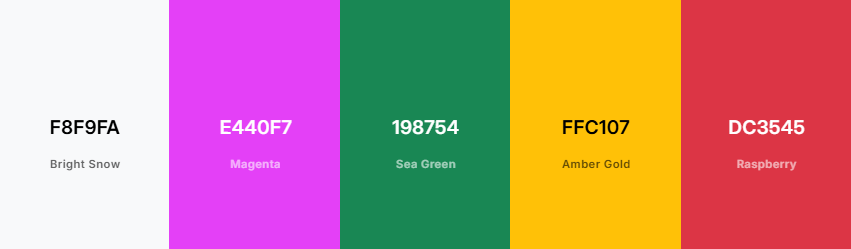
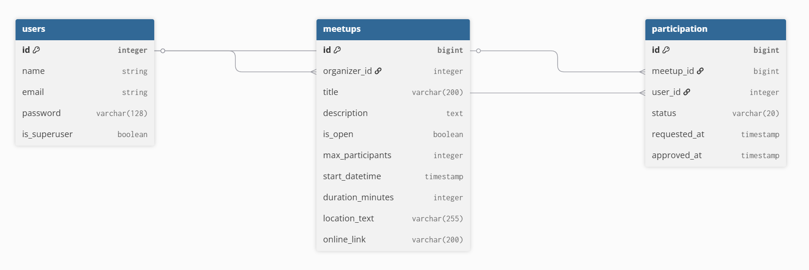

# MeetMeet

MeetMeet is a community-centric event management platform designed to bridge the gap between local organizers and attendees. Built with a focus on ease of use and mobile-first design, MeetMeet allows users to discover upcoming events, manage their own gatherings, and interact with their community through a streamlined, secure interface.

[View the Live Project on Render](https://meetmeet.onrender.com/)

## Responsive Design

The application is fully responsive, ensuring a consistent user experience across desktop, tablet, and mobile devices.


_Note: This image showcases the application's layout adaptability across various screen sizes._

---

## Agile Methodology

### Summary of Methodology

This project was developed using Agile principles, specifically utilizing the Kanban method to manage tasks and workflow. The development process focused on iterative delivery, ensuring that the Minimum Viable Product (MVP) was established first before moving on to advanced features. This approach allowed for continuous integration and rapid adaptation to technical challenges.

[Link to GitHub Project Board](https://github.com/users/sasha-fedorov/projects/4)

### Specifics of Methodology

The work was organized using a hierarchical structure to maintain scope and clarity:

- **Themes:** The project was divided into high-level categories (User Identity, Content Lifecycle, Community Engagement, Discovery).
- **Epics:** These themes were broken down into Epics, such as "Organizer Control Center" and "Secure Authentication," which represented significant blocks of functionality.
- **User Stories:** Each feature implementation began as a User Story (e.g., "As a user, I want to join an event...").
  - **Acceptance Criteria:** Every User Story included specific criteria that defined the "Definition of Done," ensuring functional requirements were met before the task was closed.
  - **MoSCoW Prioritization:** Tasks were prioritized into "Must Have" (MVP) and "Won't Have" (Future Features) to strictly adhere to the project deadline.

---

## UX Planning

### Planning Description

The design process began with a "Content-First" approach, identifying the necessary data (Titles, Dates, Status) before determining the layout. The goal was to reduce cognitive load by presenting the most critical information—such as event status and "Call to Action" buttons—in prominent positions.

<!-- ### Wireframes

TODO: Add Wireframes

Wireframes were created using Canva to visualize the layout for mobile and desktop views prior to writing code.

- **Base Layout:** 
- **Meetup List:** 
- **Meetup Detail:** 
- **Forms (Create/Edit):** 
- **Authentication (Login/Signup):** 
- **404 Error Page:**  -->

<!-- ### Design System

TODO: Add colorpalette

**Color Palette**
The palette uses a high-contrast primary pink for actions, with distinct status colors (Green/Success, Red/Danger, Yellow/Warning) to provide immediate feedback.
 -->

<!-- **Typography**

TODO: Add Typography

- **Primary Font:** [DM Sans](https://fonts.google.com/specimen/DM+Sans)
- **Weights:**
  - **400 (Regular):** Used for body text and descriptions for readability.
  - **800 (ExtraBold):** Used for the Navbar Brand and major headings to establish hierarchy. -->

---

## Features Implemented and Futures

### Existing Features

- **User Authentication:** Secure registration and login functionality handled via `django-allauth`.
- **Event Management (CRUD):** Users can Create, Read, Update, and Delete their own meetups.
- **Smart Permissions:** Only the organizer of an event can edit or delete it.
- **Dynamic Participation:**
  - **Open Events:** Users can join instantly.
  - **Restricted Events:** Users must request approval; the status defaults to "Pending".
- **Organizer Dashboard:** A dedicated section on the event page for organizers to Approve, Reject, or Remove participants.
- **Prioritized Feed:** The homepage automatically sorts events created by the logged-in user to the top of the list.
- **Defensive Design:** Backend validation prevents users from scheduling events in the past or joining events that have already finished.

### Future Features (Roadmap)

- **User Profile:** Ability to upload a profile image and set a display name.
- **Advanced Security:** Password reset via email and email address confirmation.
- **Notifications:** Email alerts for organizers when a new join request is received.
- **Participant Limits:** Automatically closing an event when `max_participants` is reached.
- **Search & Filter:** Filtering events by date range or location.

---

## Data Model and Schema

### Data Model Strategy

The project utilized a "Model-First" approach. The relational database structure was defined in Python classes (`models.py`) before any views or templates were created. This ensured that data integrity rules (such as unique constraints between Users and Meetups) were enforced at the database level.

### Django Migrations

Django's migration system was utilized to propagate changes from the Python models to the PostgreSQL database schema. This allowed for version-controlled database evolution throughout the development lifecycle.

<!-- ### Database Schema

TODO: Add Database Diagram

 -->

---

## Validation

### Python Validation

Code adherence to PEP8 standards was maintained during development using the `autopep8` extension for VS Code.

<!-- ### HTML & CSS Validation

TODO: Add Validation Screenschoots

The deployed application was validated using the W3C Markup Validation Service and the W3C CSS Validation Service.

- **HTML Validation:** 
- **CSS Validation:** 

### Lighthouse Performance

Google Chrome Lighthouse was used to test Performance, Accessibility, Best Practices, and SEO.

- **Lighthouse Score:**  -->

---

## Testing

### Automated Testing

Automated tests were written using `django.test.TestCase` to verify model logic and view permissions.

- **Scope:** Tests cover model validation (preventing past dates), permission mixins (restricting edit access), and participation status transitions.
- **Execution:** Tests are run via `python manage.py test`.

### Manual Testing

Manual testing was conducted throughout the development process and after deployment on the following devices:

- **Desktop:** Windows PC (FHD, 2K, 4K monitors)
- **Mobile:** iPhone 16 Pro
- **Tablet:** iPad 10

| Feature          | Action                                  | Expected Result                          | Status |
| :--------------- | :-------------------------------------- | :--------------------------------------- | :----- |
| **Registration** | Submit valid form                       | Account created, redirected to home      | Pass   |
| **Login**        | Enter invalid credentials               | Error message displayed                  | Pass   |
| **Create Event** | Leave required fields empty             | Form validation error messages appear    | Pass   |
| **Join Event**   | Click "Join" on Open event              | Status becomes "Going", button changes   | Pass   |
| **Edit Event**   | Access edit URL of another user's event | Redirected to home page (Security check) | Pass   |
| **Past Event**   | Attempt to edit a past event            | Action blocked, user notified            | Pass   |

<!-- TODO: Extend test table -->

### Bugs

<!-- TODO: Add fixed/known bugs list
**Fixed Bugs**

**Known Bugs**
-->

---

## Libraries, Languages, and Tools

### Languages & Frameworks

- **Python:** Selected for its readability and robust ecosystem.
- **Django:** Chosen for its "batteries-included" approach, providing built-in authentication, ORM, and security against common attacks (CSRF, SQL Injection).
- **HTML5 / CSS3:** Used for semantic markup and styling.
- **Bootstrap 5:** Used for rapid, responsive UI development and grid system.

### Libraries & Utilities

- **PostgreSQL:** Chosen as the production database for its reliability and relational integrity compared to SQLite.
- **Gunicorn:** A production-grade WSGI HTTP Server for UNIX, used to serve the Django application on Render.
- **WhiteNoise:** Used to serve static files efficiently directly from the Django application in production.
- **Dotenv:** Used to manage environment variables (secrets) securely during local development.

### Tools & Programs

- **[VS Code](https://code.visualstudio.com/)** – Main code editor for development.
- **[Google Chrome](https://www.google.com/chrome/)** – Browser for testing and verifying web functionality.
- **[Chrome DevTools](https://developer.chrome.com/docs/devtools)** – Used for debugging and checking responsiveness.
- **[autopep8 VSCode Extension](https://marketplace.visualstudio.com/items?itemName=ms-python.autopep8)** – Enforced PEP8 compliance.
- **[Fork](https://fork.dev/)** – Git client for version control.

### Services

- **[Render](https://render.com/)** – Cloud platform for deployment and database hosting.
- **[GitHub](https://github.com/)** – Code repository and project board hosting.
- **[ChatGPT](https://chat.openai.com/)** – Used as a search tool and syntax reference.
- **[Gemini](https://gemini.google.com/)** – Used for documentation structure, logic troubleshooting, and content generation.
<!-- - **[Coolors](https://coolors.co/)** – Color palette generation.
- **[dbdiagram.io](https://dbdiagram.io/)** – Database schema visualization. -->

---

## Deployment & Local Development

### Deployment

The application is deployed on **Render** using a PostgreSQL database.

1.  **Database:** A managed PostgreSQL instance was created on Render.
2.  **Web Service:** A new Web Service was linked to the GitHub repository.
3.  **Environment Variables:** The following variables were set in the Render dashboard:
    - `DATABASE_URL`: Connection string provided by Render.
    - `SECRET_KEY`: A generated Django secret key.
    - `PYTHON_VERSION`: `3.14.0` Required Python version.
    - `WEB_CONCURRENCY`: `4` Required Render constant.
4.  **Build Script:** A `build.sh` script was added to handle dependency installation, static file collection, and database migrations.

### Local Development

To run this project locally, follow these steps:

1.  **Cloning:**
    - Navigate to the location where you want to create the project directory.
      - Example: `cd Documents/GitHub_Projects`
    - Type the following command and press **Enter**:

    ```bash
    git clone https://github.com/sasha-fedorov/meetmeet.git
    ```

2.  **Environment Setup:**
    - Ensure Python 3.14 is installed.
    - Create a virtual environment:
      ```bash
      python -m venv venv
      source venv/bin/activate  # On Windows use: venv\Scripts\activate
      ```
    - Install dependencies:
      ```bash
      pip install -r requirements.txt
      ```
3.  **Configuration:**
    - Create a `.env` file in the root directory.
    - Add your `SECRET_KEY` and `DATABASE_URL` (or use local SQLite).
4.  **Database:**
    - Run migrations:
      ```bash
      python manage.py migrate
      ```
    - Create a superuser:
      ```bash
      python manage.py createsuperuser
      ```
5.  **Running:**
    - Start the server:
      ```bash
      python manage.py runserver
      ```

### Forking

To fork the **MeetMeet** repository to your own GitHub account:

1. Log in (or sign up) to GitHub.
2. Go to the repository: **[sasha-fedorov/meetmeet](https://github.com/sasha-fedorov/meetmeet)**.
3. Click the **Fork** button in the top right corner to create a copy under your own account.

---

## Credits

### Media

- **Meetups List Background Image:** [Freepik - Happy friends home party](https://www.freepik.com/free-vector/happy-friends-home-party-isolated-flat-vector-illustration-cartoon-group-students-dancing-talking-having-fun-together-apartment_10172831.htm)

### Code & Reference

- **Python Gitignore:** [GitHub Python .gitignore template](https://github.com/github/gitignore/blob/main/Python.gitignore)
- **Django Documentation:** Referenced for Class-Based Views and Authentication patterns.
