# Testing and Validation

## Validation

### Python Validation

Code adherence to PEP8 standards was maintained during development using the `autopep8` extension for VS Code; no errors remain in the final project.

### HTML Validation

Public pages were verified using the [W3C Validation Service](https://validator.w3.org/), while authenticated pages were manually validated to ensure markup integrity; no errors remain in the final project.

  
<b>Click to expand HTML validation results (Public Pages)</b>

  <table>
    <tr>
      <th>Page</th>
      <th>Validation Link</th>
      <th>Validation Result</th>
    </tr>
    <tr>
      <td width="30%"><a href="https://meetmeet.onrender.com/">Meetup List</a></td>
      <td width="30%"><a href="https://validator.w3.org/nu/?doc=https%3A%2F%2Fmeetmeet.onrender.com%2F">Validation Result</a></td>
      <td width="40%">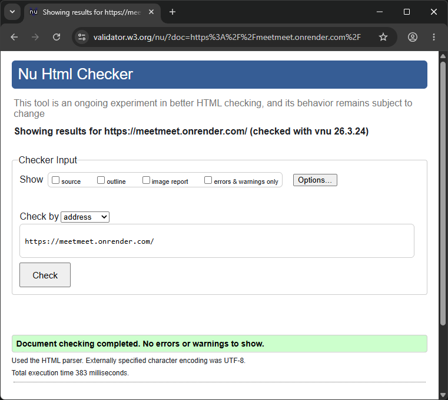</td>
    </tr>
    <tr>
      <td width="30%"><a href="https://meetmeet.onrender.com/meetups/1">Meetup Detail</a></td>
      <td width="30%"><a href="https://validator.w3.org/nu/?doc=https%3A%2F%2Fmeetmeet.onrender.com%2Fmeetups%2F1">Validation Result</a></td>
      <td width="40%"></td>
    </tr>
    <tr>
      <td width="30%"><a href="https://meetmeet.onrender.com/accounts/signup">Account Register</a></td>
      <td width="30%"><a href="https://validator.w3.org/nu/?doc=https%3A%2F%2Fmeetmeet.onrender.com%2Faccounts%2Fsignup">Validation Result</a></td>
      <td width="40%">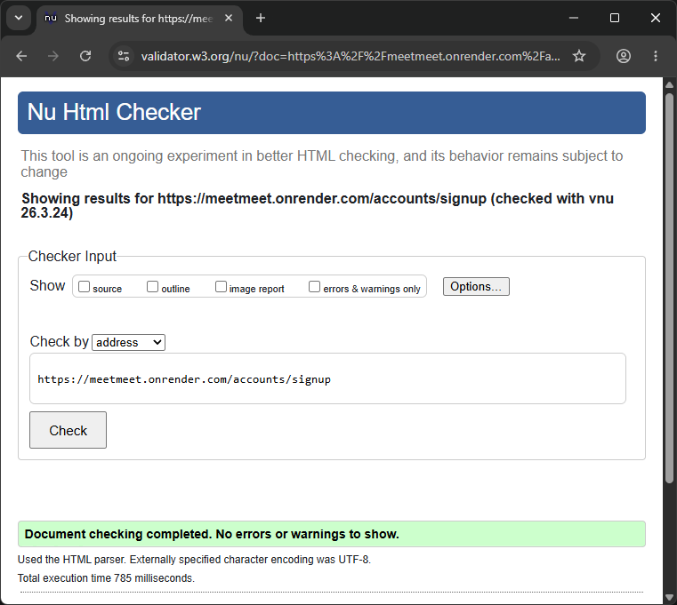</td>
    </tr>
    <tr>
      <td width="30%"><a href="https://meetmeet.onrender.com/accounts/login">Account Login</a></td>
      <td width="30%"><a href="https://validator.w3.org/nu/?doc=https%3A%2F%2Fmeetmeet.onrender.com%2Faccounts%2Flogin">Validation Result</a></td>
      <td width="40%">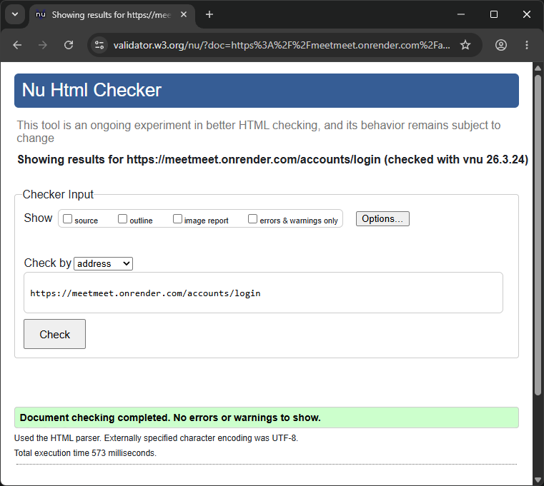</td>
    </tr>
    <tr>
      <td width="30%"><a href="https://meetmeet.onrender.com/about">About</a></td>
      <td width="30%"><a href="https://validator.w3.org/nu/?doc=https%3A%2F%2Fmeetmeet.onrender.com%2Fabout">Validation Result</a></td>
      <td width="40%"></td>
    </tr>
    <tr>
      <td width="30%"></td>
      <td width="30%"><a href="">Validation Result</a></td>
      <td width="40%"></td>
    </tr>
  </table>

  
<b>Click to expand HTML validation results (Authenticated Pages)</b>

  There are three primary areas requiring authentication that were validated through manual source code input. 

  The Participation Management, and Logout pages returned no errors or warnings.
  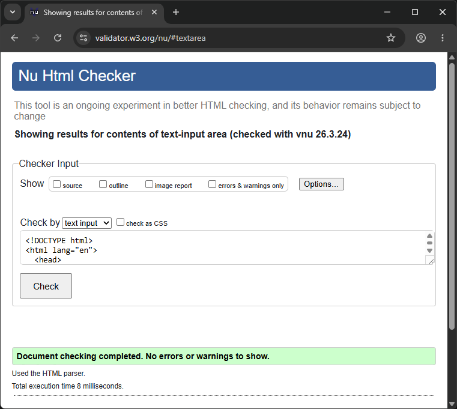

  The Meetup Form page currently contains a validation error regarding the placeholder attribute on a non-supported input type. This has been documented in the Known Issues section and will be resolved by implementing a custom forms.py (MeetupForm) to refine the widget attributes.

  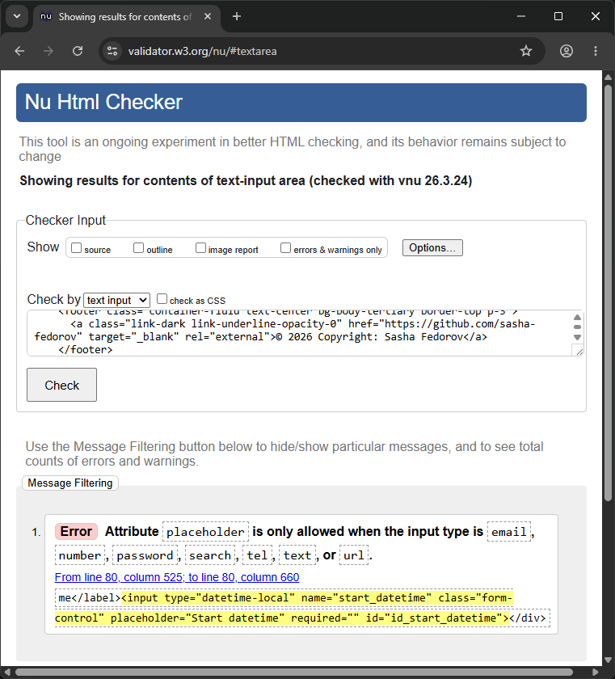

### CSS Validation

All styling was verified for W3C compliance by manually inputting the style.css file into the [Jigsaw CSS Validator](https://jigsaw.w3.org/css-validator/). The final report is error-free, noting only standard warnings regarding the dynamic nature of CSS variables which cannot be statically checked.

  
<b>Click to expand CSS validation result</b>

  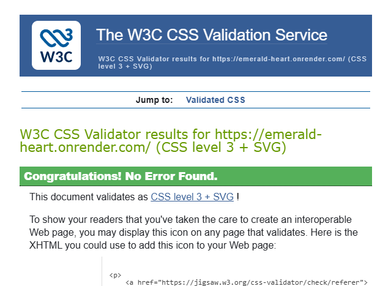

### Lighthouse Performance

Google Chrome Lighthouse was used to test Performance, Accessibility, Best Practices, and SEO.

  
<b>Click to expand Lighthouse report scores</b>

  <table>
    <tr>
      <th>Page</th>
      <th>Score</th>
    </tr>
    <tr>
      <td width="30%">Meetup List</td>
      <td width="70%">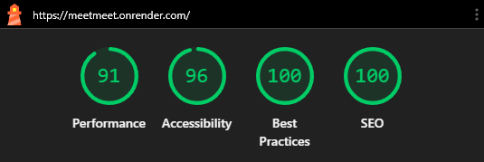</td>
    </tr>
    <tr>
      <td width="30%">Meetup Detail</td>
      <td width="70%">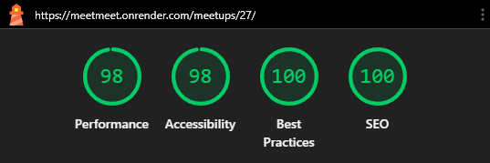</td>
    </tr>
    <tr>
      <td width="30%">Meetup Form</td>
      <td width="70%">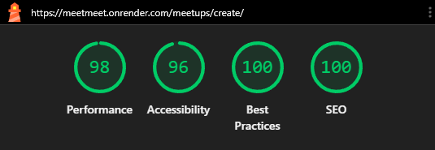</td>
    </tr>
    <tr>
      <td width="30%">Account Register</td>
      <td width="70%"></td>
    </tr>
    <tr>
      <td width="30%">Account Login</td>
      <td width="70%">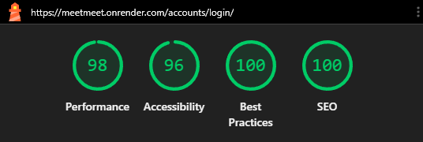</td>
    </tr>
    <tr>
      <td width="30%">Account Logout</td>
      <td width="70%">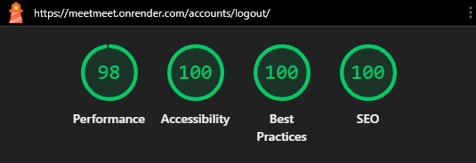</td>
    </tr>
    <tr>
      <td width="30%">About</td>
      <td width="70%">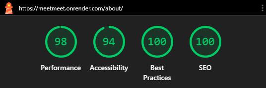</td>
    </tr>
    <tr>
      <td width="30%">Error Page</td>
      <td width="70%">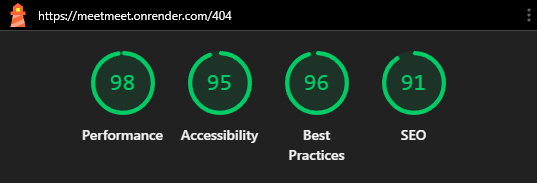</td>
    </tr>
  </table>

## Testing

### Automated Testing

Automated tests were written using `django.test.TestCase` to verify model logic and view permissions.

- **Scope:** Tests cover model validation (preventing past dates), permission mixins (restricting edit access), and participation status transitions.
- **Execution:** Tests are run via `python manage.py test`.

### Manual Testing

Manual testing was conducted throughout the development process and after deployment on the following devices:

- **Desktop:** Windows PC (FHD, 2K, 4K monitors)
- **Mobile:** iPhone 16 Pro
- **Tablet:** iPad 10

| Feature          | Action                                  | Expected Result                          | Status |
| :--------------- | :-------------------------------------- | :--------------------------------------- | :----- |
| **Registration** | Submit valid form                       | Account created, redirected to home      | Pass   |
| **Login**        | Enter invalid credentials               | Error message displayed                  | Pass   |
| **Create Event** | Leave required fields empty             | Form validation error messages appear    | Pass   |
| **Join Event**   | Click "Join" on Open event              | Status becomes "Going", button changes   | Pass   |
| **Edit Event**   | Access edit URL of another user's event | Redirected to home page (Security check) | Pass   |
| **Past Event**   | Attempt to edit a past event            | Action blocked, user notified            | Pass   |

<!-- TODO: Extend test table -->

### Bugs

<!-- TODO: Add fixed/known bugs list
**Fixed Bugs**

**Known Bugs**
-->

