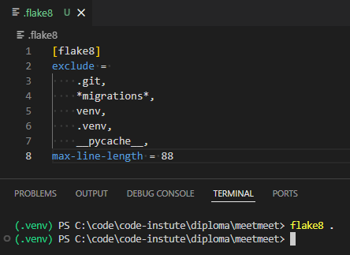
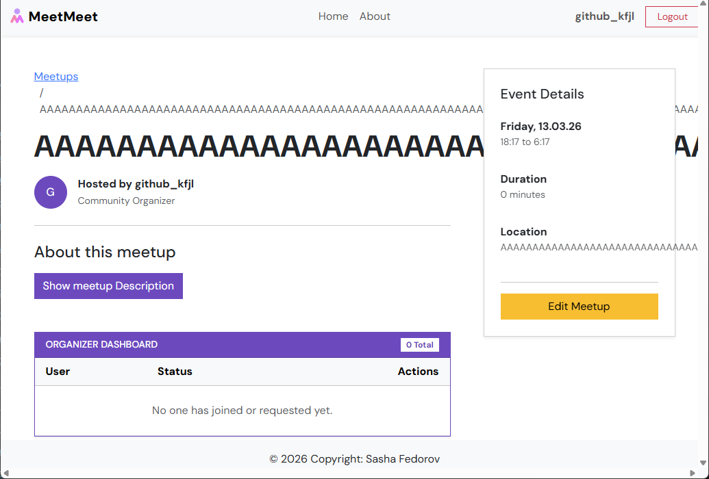
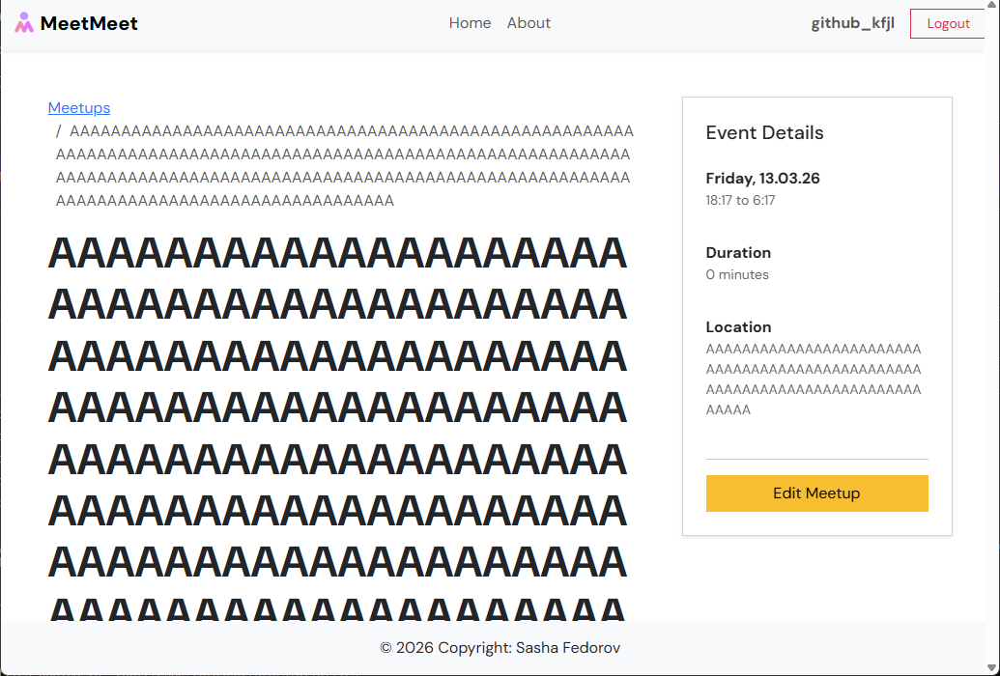
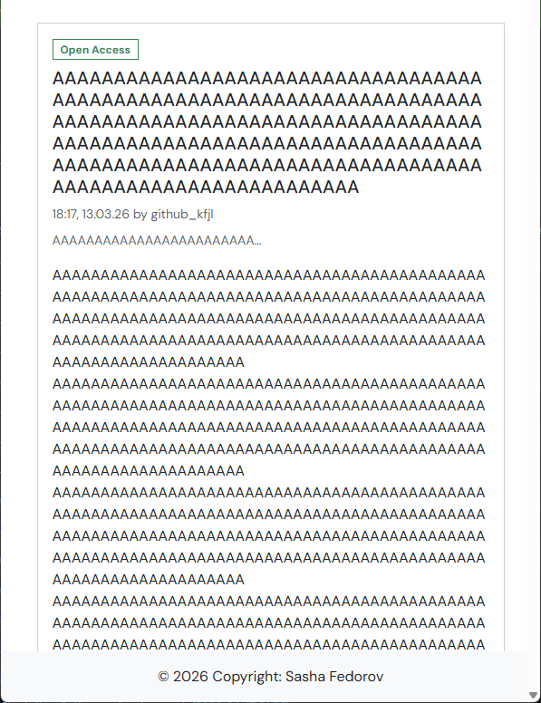
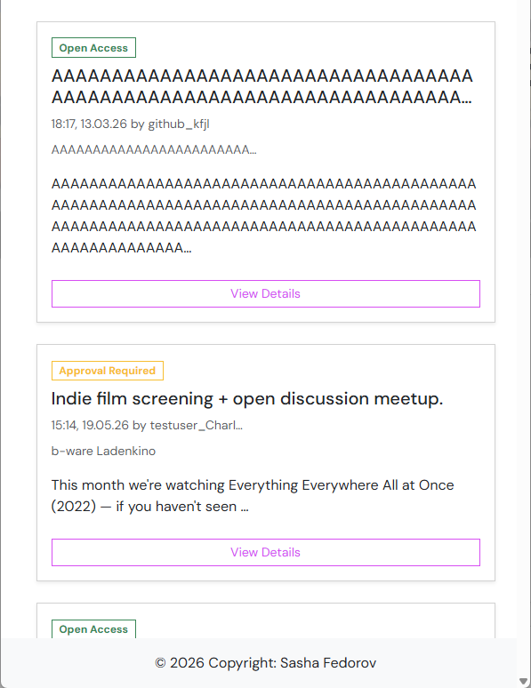

# Testing and Validation

## Validation

### Python Validation

To ensure the highest code quality and adherence to PEP 8 standards, this project was validated using two layers of linting:

- Real-time Linting: The Flake8 extension for VS Code was utilized throughout the development process for immediate feedback.
- Project-wide Audit: A final, comprehensive validation was performed by running the flake8 package directly in the terminal across the entire codebase.

A custom .flake8 configuration was implemented to focus specifically on project logic while excluding external dependencies (such as the virtual environment and auto-generated Django migrations).

The final audit confirms zero PEP 8 violations.



### HTML Validation

Public pages were verified using the [W3C Validation Service](https://validator.w3.org/), while authenticated pages were manually validated to ensure markup integrity; no errors remain in the final project.

<details>
  <summary><b>Click to expand HTML validation results (Public Pages)</b></summary>
  <table>
    <tr>
      <th>Page</th>
      <th>Validation Link</th>
      <th>Validation Result</th>
    </tr>
    <tr>
      <td width="30%"><a href="https://meetmeet.onrender.com/">Meetup List</a></td>
      <td width="30%"><a href="https://validator.w3.org/nu/?doc=https%3A%2F%2Fmeetmeet.onrender.com%2F">Validation Result</a></td>
      <td width="40%"></td>
    </tr>
    <tr>
      <td width="30%"><a href="https://meetmeet.onrender.com/meetups/1">Meetup Detail</a></td>
      <td width="30%"><a href="https://validator.w3.org/nu/?doc=https%3A%2F%2Fmeetmeet.onrender.com%2Fmeetups%2F1">Validation Result</a></td>
      <td width="40%"></td>
    </tr>
    <tr>
      <td width="30%"><a href="https://meetmeet.onrender.com/accounts/signup">Account Register</a></td>
      <td width="30%"><a href="https://validator.w3.org/nu/?doc=https%3A%2F%2Fmeetmeet.onrender.com%2Faccounts%2Fsignup">Validation Result</a></td>
      <td width="40%"></td>
    </tr>
    <tr>
      <td width="30%"><a href="https://meetmeet.onrender.com/accounts/login">Account Login</a></td>
      <td width="30%"><a href="https://validator.w3.org/nu/?doc=https%3A%2F%2Fmeetmeet.onrender.com%2Faccounts%2Flogin">Validation Result</a></td>
      <td width="40%"></td>
    </tr>
    <tr>
      <td width="30%"><a href="https://meetmeet.onrender.com/about">About</a></td>
      <td width="30%"><a href="https://validator.w3.org/nu/?doc=https%3A%2F%2Fmeetmeet.onrender.com%2Fabout">Validation Result</a></td>
      <td width="40%"></td>
    </tr>
    <tr>
      <td width="30%"><a href=""></a></td>
      <td width="30%"><a href="">Validation Result</a></td>
      <td width="40%"></td>
    </tr>
  </table>
</details>

<details>
  <summary><b>Click to expand HTML validation results (Authenticated Pages)</b></summary>

  There are three primary areas requiring authentication that were validated through manual source code input. 

  The Participation Management, and Logout pages returned no errors or warnings.
  


  The Meetup Form page currently contains a validation error regarding the placeholder attribute on a non-supported input type. This has been documented in the Known Issues section and will be resolved by implementing a custom forms.py (MeetupForm) to refine the widget attributes.

  
</details>

### CSS Validation

All styling was verified for W3C compliance by manually inputting the style.css file into the [Jigsaw CSS Validator](https://jigsaw.w3.org/css-validator/). The final report is error-free, noting only standard warnings regarding the dynamic nature of CSS variables which cannot be statically checked.

<details>
  <summary><b>Click to expand CSS validation result</b></summary>

  
</details>

### Lighthouse Performance

Google Chrome Lighthouse was used to test Performance, Accessibility, Best Practices, and SEO.

<details>
  <summary><b>Click to expand Lighthouse report scores</b></summary>
  <table>
    <tr>
      <th>Page</th>
      <th>Score</th>
    </tr>
    <tr>
      <td width="30%">Meetup List</td>
      <td width="70%"></td>
    </tr>
    <tr>
      <td width="30%">Meetup Detail</td>
      <td width="70%"></td>
    </tr>
    <tr>
      <td width="30%">Meetup Form</td>
      <td width="70%"></td>
    </tr>
    <tr>
      <td width="30%">Account Register</td>
      <td width="70%"></td>
    </tr>
    <tr>
      <td width="30%">Account Login</td>
      <td width="70%"></td>
    </tr>
    <tr>
      <td width="30%">Account Logout</td>
      <td width="70%"></td>
    </tr>
    <tr>
      <td width="30%">About</td>
      <td width="70%"></td>
    </tr>
    <tr>
      <td width="30%">Error Page</td>
      <td width="70%"></td>
    </tr>
  </table>
</details>


## Testing

### Automated Testing

Automated tests use Django's built-in unit testing framework (`django.test.TestCase`) to verify core application functionality without relying on manual checks.

- **Framework used:** Django `TestCase` (unit tests run in an isolated test database).
- **What is tested:**
  - Model logic and validation (e.g., preventing past start dates, computed `end_datetime`).
  - Participation workflow and state transitions (approve/request/cancel, timestamps).
  - View permissions and access control (only organizers may edit; redirect behaviour for unauthorized access).
  - Key view actions (toggle participation, approve participation, redirects and HTTP responses).
- **Why:** These tests exercise the main meetups project behavior to ensure data integrity, permission enforcement, and expected user flows.
- **Run locally:**

```bash
python3 manage.py test meetups
```

Tests are included in `meetups/tests.py` and are fast to run; they provide confidence that features work as intended and help prevent regressions during development.

### Manual Testing

Manual testing was conducted throughout development and after deployment on the following devices:

- **Desktop:** Windows PC (FHD, 2K, 4K monitors)
- **Mobile:** iPhone 16 Pro
- **Tablet:** iPad 10

#### User Identity & Accounts

| Test | Result | Notes |
|:-----|:------:|:------|
| User can create an account | Pass | |
| User can create an account without email | Pass | |
| Registration form validates inputs correctly | Pass | |
| Login / registration forms show clear explanations for incorrect inputs | Pass | |
| User is automatically signed in after registration | Pass | |
| User can sign in | Pass | |
| User can sign out | Pass | |

#### Meetup Content Lifecycle

| Test | Result | Notes / Fix |
|:-----|:------:|:-----------|
| Unauthorized user cannot create meetups | Pass | |
| User can create a meetup | Pass | |
| User can update a meetup | Pass | |
| User can only edit their own meetups | Pass | |
| Create / update forms validate inputs correctly | Pass | |
| Create / update forms show clear explanations for incorrect inputs | Pass | |
| User can delete meetup | Fail | While styling the page the delete functionality was lost; restored working form functionality (fixed) |

#### Meetup Participation

| Test | Result | Notes / Fix |
|:-----|:------:|:-----------|
| Users and organizers receive clear messages for interactions | Fail | Added messages for key events (fixed) |
| User can join open meetups | Pass | |
| User can cancel attendance | Pass | |
| User can request to join meetup | Pass | |
| User can cancel request | Pass | |
| User can see participation status (going / not going / requested) | Pass | |
| Organizer can see participants | Pass | |
| Organizer can manage participants (approve / decline / remove) | Pass | |


### Bugs and issues

#### Fixed

| Issue | Fix | Status |
|------|-----|:------:|
| Meetup card on meetup list page did not display organizer name | Replaced weekday name with organizer name to surface valuable info | Fixed |
| Meetup preview title had no character limit (description limited by words only) | Added `truncatechars` formatter to limit title length | Fixed |
| Pages lacked word-wrap; long words overflowed containers | Added `text-break` utility class to base template to prevent overflow | Fixed |
| Delete button on meetup edit page not working | Restored lost delete-button handler/formatter removed during styling | Fixed |
| No confirmation before meetup deletion | Added Bootstrap confirmation pop-up to prevent accidental deletes | Fixed |
| Organizer's meetups looked identical to others on the list | Refactored conditional button text and styling for organizer UX | Fixed |
| `404` template placed outside conventional location | Moved `404` template to the standard templates directory | Fixed |
| Server returned uninformative response for `500` errors | Added a `500` error template to improve debug UX | Fixed |
| Users not notified about important actions (create/update/delete) | Added Django messages for create/update/delete meetup operations | Fixed |
| Ad blocker hid meetup list header due to `banner-container` ID | Renamed ID to `meetups-top-container` to avoid common adblock rules | Fixed |
| Toggle participation flow: login redirect caused `405` error | Added `GET` handler to `ToggleParticipationView` to redirect back to meetup detail | Fixed |

**Beyond these, numerous smaller improvements and additional fixes are thoroughly documented in the project’s commit history for detailed reference.**

Below are visual examples showing issues and their fixes.

Long-word overflow (before / after):
| Before | After |
|:------:|:----:|
|  |  |

Meetup preview title limits (before / after):
| Before | After |
|:------:|:----:|
|  |  |

#### Known

| Issue | Notes | Workaround |
|:-----|:------|:---------|
| W3C validation for meetup form: "Attribute placeholder is only allowed when the input type is email, number, password, search, tel, text, or url." | This is caused by using `placeholder` on a field widget type that doesn't support it. | Create a `forms.py` with `MeetupForm` and explicitly set appropriate widget attributes (planned fix). |

